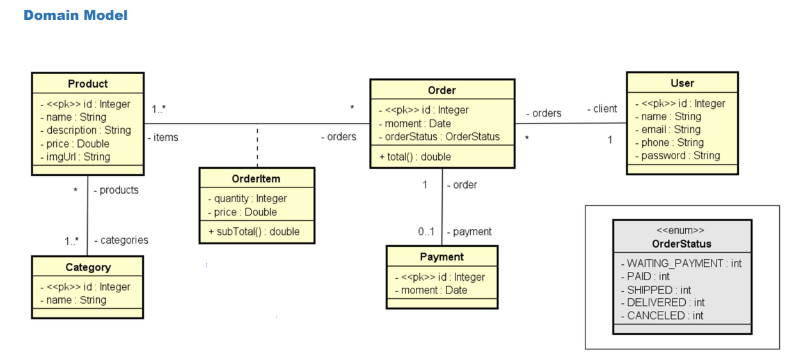

# Ordering system
This application consists in a Ordering System, you can register users, products and categories and 
create a new order.<br>

I've been working in this application to improve my knowledge in Web Development with SpringBoot.
At this time, the application is still a simple API REST.<br>

## Table of contents
- [Run](#run)
- [EndPoints](#endpoints)
- [Development](#development)
- [Database Access](#database-access)
- [Future Commits](#future-commits)

## Run
- git clone git@github.com:victorhtl/ordering-system-springboot.git
- Open with intellij
- Configure java 21
- Run the [Application.java](src/main/java/com/course/spring/Application.java) file
- The API will run at localhost:8080

## EndPoints
The API uses the JSON format, use <b>raw</b> mode if you are using Postman
### Get
/orders<br>
/categories<br>
/product<br>
/OrderItem<br>
/users<br>
/users/{id}<br>
### Post
/users<br>
```json
{ 
 "name": "Bob Brown", 
 "email": "bob@gmail.com", 
 "phone": "977557755", 
 "password": "123456" 
}
```
### Update
/users/{id}
```json
{ 
 "name": "Bob Brown", 
 "email": "bob@gmail.com", 
 "phone": "977557755" 
}
```
### Delete
/users/{id}


## Development
This is the domain model for our back-end application

The technologies used were:
- Java 21
- Springboot 3.2.4
- JPA/Hibernate
- Maven

##  Database access
This app is current running an H2 database, which is an in-memory database used for tests. When you
run the application, the program will automatically create this database and add some items. You can
check the database by the admin section of H2, in localhost:8080/h2-console


## Future commits
- Implement access authentication 
- Implement user login and sign up
- Implement client-side interface with
- Implement an interface for admin area
- Images in products
- Implements search box for products
- Implement postgreSQL
